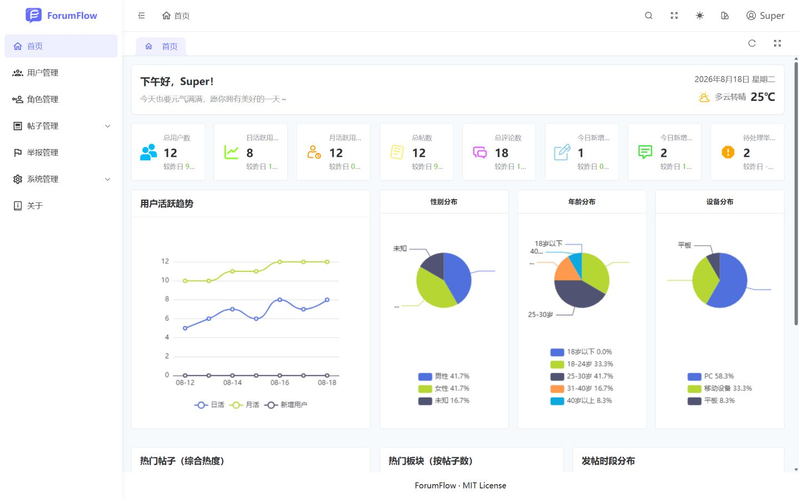
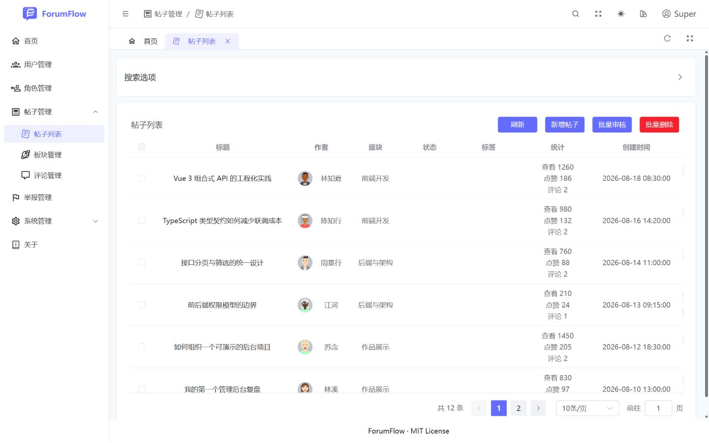
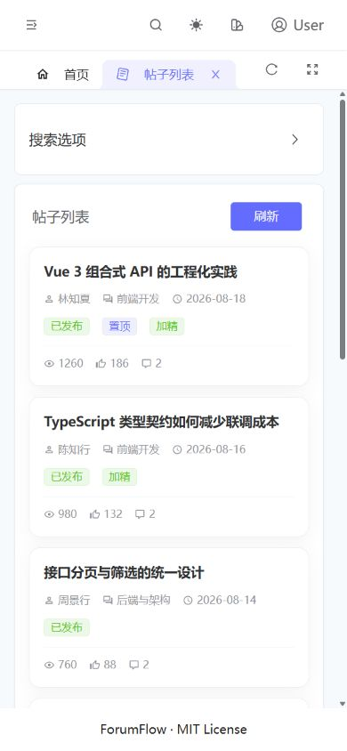

  
  <h1>ForumFlow Community Admin</h1>
  
Moderation, operations, and role management for forum communities

  
<strong>Live demo:</strong> <a href="https://forumflow-admin.vercel.app/">https://forumflow-admin.vercel.app/</a>

  
<a href="./README.md">中文</a> | English

---

ForumFlow is a Vue 3, TypeScript, and Element Plus community operations dashboard. It covers content moderation, users and roles, forum settings, notices, analytics, and profile workflows.

## Preview

| Operations dashboard | Post moderation |
| --- | --- |
|  |  |

  

## Demo accounts

| Role | Username | Password | Access |
| --- | --- | --- | --- |
| Super administrator | <code>Super</code> | <code>123456</code> | Every module, role permissions, and system settings |
| Administrator | <code>Admin</code> | <code>123456</code> | Users, posts, forums, comments, reports, and notices |
| Community user | <code>User</code> | <code>123456</code> | Published posts, enabled forums, and published notices |

The demo uses a deterministic baseline. Mutations demonstrate UI feedback; refreshing or querying again restores the baseline.

## Highlights

- Static-route RBAC plus centralized button permission codes.
- Runtime Iconify icons load on demand from its public API; deployment CSP must allow the primary and two fallback hosts in <code>connect-src</code>, otherwise dynamic icons render empty.
- Protected-account rules that limit administrators to community users.
- 68 self-contained Apifox scripts generated from one fixed, relational dataset.
- DOMPurify-based rich-text rendering with an HTTPS iframe host allowlist.
- Responsive business pages for desktop and 390px-class mobile screens.
- TypeScript contracts aligned with the business API modules.

## Stack

Vue 3.5 · TypeScript 5.9 · Vite 7 · Element Plus · Pinia · Vue Router · UnoCSS · pnpm workspace · Apifox Mock · WangEditor · DOMPurify

## Run locally

Requirements: Node.js <code>>=20.19.0</code>, pnpm <code>>=8.7.0</code>.

~~~bash
pnpm install
cp .env.example .env
pnpm dev
~~~

Verification:

~~~bash
pnpm typecheck
pnpm exec eslint .
pnpm build
node apifox-mock/tools/verify.mjs
~~~

## Technical origin

The project uses [SoybeanAdmin ElementPlus](https://github.com/soybeanjs/soybean-admin-element-plus) as its engineering foundation. My primary work covers the business pages, API and type contracts, RBAC, deterministic Apifox demos, safe rich-text rendering, and responsive adaptation. Both projects use the MIT license.

## License

[MIT](./LICENSE)
